```{r setup, include=FALSE}
library(tidyverse)
library(gridExtra)
library(cmdstanr)
library(posterior)
library(knitr)
library(ggplot2)
library(bayesplot) 
library(stringr)
library(tools)
library(fs)
library(glue)
library(png)
library(grid)
library(purrr)
library(dplyr)


knitr::opts_chunk$set(echo = TRUE)
```

# 1.目的

## 1.1【大きい目的】

人間が社会規範に従うメカニズムを明らかにする

そのために、既存の複数の理論が提案する「規範遵守のメカニズム」が、互いにどのように異なり、どのように識別可能であるかを明らかにしたい


## 1.2【中ぐらいの目的】

フィッティング（パラメータリカバリー）を行うことで以下のことを確認する

強化学習エージェントから生成された行動データに対して、それぞれの強化学習モデルをフィッティングして、パラメータがうまく推定されているかを確認する

たとえば学習率 = 0.6、 逆温度 = 0.2という値の下で生成されたデータに、モデルをフィッティングしたとき、この2つの値が推定されないならば、モデルフィッティングがあまりうまくいかないことを意味する

## 1.3【小さい目的】

課題ごとでフィッティング結果にどのような違いがあるかを確認する。

# 2.課題設定

t0では、行動A（規範的な行動）を確率P(A)で、行動B（非規範的な行動）を確率1-P(A)で選択する

行動Aを選択すると確率T(r1| t0, A)でr1に、1-T(r2| t0, A)でr2の報酬を受け取る

行動Bを選択すると確率T(r3| t0, B)でr3に、1-T(r4| t0, B)でr4の報酬を受け取る

## 2.1 実施内容

各モデルから1つのパラメータ条件を選び、フィッティングする

フィッティング結果に対して、それぞれのモデルのパラメータにおけるtraceplotと事後分布をプロットする

フィッティング結果に対して、実際の選択確率と事後予測プロットの比較をする

## 2.2 stanファイルの事前分布（数式）

\[
\begin{aligned}
\alpha &\sim \mathrm{Beta}(2, 2) \\
\beta  &\sim \mathrm{LogNormal}(\log 1,\,0.5) \\
Q_{\mathrm{init},1} &\sim \mathcal{N}(3.75,\,2) \\
Q_{\mathrm{init},2} &= 0
\end{aligned}
\]

stanファイルは以下を使用した

```
data {
  int<lower=1> N;
  int<lower=1> T;
  array[N, T] int<lower=0, upper=1> choice;
  array[N, T] real reward_A;
  array[N, T] real reward_B;
}

parameters {
  real<lower=0, upper=1> alpha;   
  real<lower=0>          beta;    
  real                   Q_init1; 
}

transformed parameters {
  real Q_init2 = 0;               
}

model {
  alpha   ~ beta(2, 2);
  beta    ~ lognormal(log(1), 0.5);
  Q_init1 ~ normal(3.75, 2) ;

  for (n in 1:N) {
    vector[2] Q = rep_vector(0.0, 2);
    Q[1] = Q_init1;
    Q[2] = Q_init2;

    for (t in 1:T) {
      real pA = inv_logit(beta * (Q[1] - Q[2]));
      choice[n, t] ~ bernoulli(pA);

      int a = choice[n, t] + 1;
      real r = (a == 1) ? reward_A[n, t] : reward_B[n, t];
      Q[a] += alpha * (r - Q[a]);
    }
  }
}

generated quantities {
  array[N, T] int<lower=0,upper=1> choice_rep;
  array[N, T] real              pA_track;

  for (n in 1:N) {
    vector[2] Q = rep_vector(0.0, 2);
    Q[1] = Q_init1;
    Q[2] = Q_init2;

    for (t in 1:T) {
      real pA = inv_logit(beta * (Q[1] - Q[2]));
      pA_track[n, t]   = pA;
      choice_rep[n, t] = bernoulli_rng(pA);

      int a = choice_rep[n, t] + 1;
      real r = (a == 1) ? reward_A[n, t] : reward_B[n, t];
      Q[a] += alpha * (r - Q[a]);
    }
  }
}

```


# 3 プロット

## 3.1 50人のデータと5000人のデータの比較 {.tabset .tabset-fade .tabset-pills}

### 3.1.1 T0-7_r5-5-0-15_50agents
```{r}

```

### 3.1.2 T0-7_r5-5-0-18_50agents
```{r}

```

### 3.1.3 T0-7_r5-5-0-30_50agents
```{r}

```

### 3.1.4 T0-3_r5-5-0-45/7_50agents
```{r}

```

### 3.1.5 T0-3_r5-5-0-54/7_50agents
```{r}

```

### 3.1.6 T0-3_r5-5-0-90/7_50agents
```{r}

```

### 3.1.7 T0-7_r2-2-0-5_50agents
```{r}
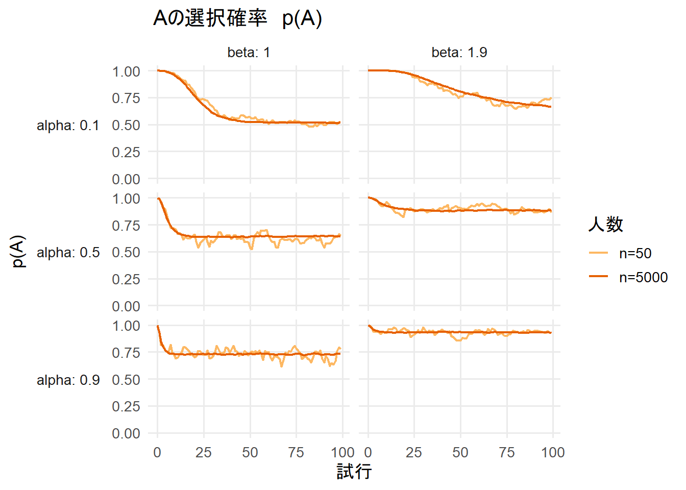
```

### 3.1.8 T0-7_r2-2-0-8_50agents
```{r}

```

### 3.1.9 T0-7_r2-2-0-20_50agents
```{r}
knitr::include_graphics("figure-html9/hyouzi-1.png")
```

### 3.1.10 T0-3_r2-2-0-15/7_50agents
```{r}

```

### 3.1.11 T0-3_r2-2-0-24/7_50agents
```{r}

```

### 3.1.12 T0-3_r2-2-0-60/7_50agents
```{r}

```

### 3.1.13 T0-9_r5-5-0-30_50agents
```{r}

```

### 3.1.14 T0-4_r5-5-0-30_50agents
```{r}

```

### 3.1.15 T0-1_r5-5-0-30_50agents
```{r}

```

### 3.1.16 T0-9_r5-5-0-15_50agents
```{r}

```

### 3.1.17 T0-4_r5-5-0-15_50agents
```{r}

```

### 3.1.18 T0-1_r5-5-0-15_50agents
```{r}

```

### 3.1.19 T0-9_r2-2-0-10_50agents
```{r}

```

### 3.1.20 T0-4_r2-2-0-10_50agents
```{r}
knitr::include_graphics("figure-html20/hyouzi-1.png")
```

### 3.1.21 T0-1_r2-2-0-10_50agents
```{r}

```

### 3.1.22 T0-9_r2-2-0-5_50agents
```{r}

```

### 3.1.23 T0-4_r2-2-0-5_50agents
```{r}

```

### 3.1.24 T0-1_r2-2-0-5_50agents
```{r}

```


## 3.2 プロットの比較

## 3.3 traceplot alpha {.tabset .tabset-fade .tabset-pills}

### 3.3.1 T0-7_r5-5-0-15_50agents
```{r}
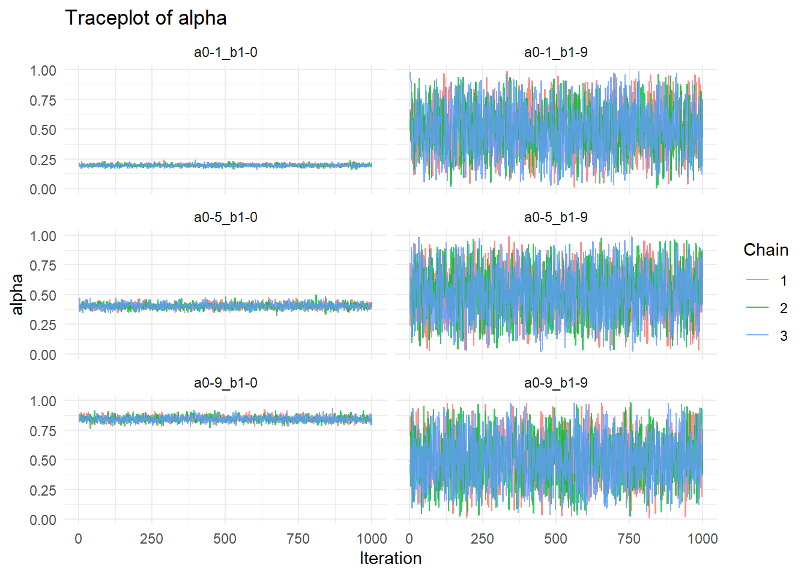
```

### 3.3.2 T0-7_r5-5-0-18_50agents
```{r}

```

### 3.3.3 T0-7_r5-5-0-30_50agents
```{r}

```

### 3.3.4 T0-3_r5-5-0-45/7_50agents
```{r}

```

### 3.3.5 T0-3_r5-5-0-54/7_50agents
```{r}

```

### 3.3.6 T0-3_r5-5-0-90/7_50agents
```{r}

```

### 3.3.7 T0-7_r2-2-0-5_50agents
```{r}

```

### 3.3.8 T0-7_r2-2-0-8_50agents
```{r}
knitr::include_graphics("figure-html8/alpha1-1.png")
```

### 3.3.9 T0-7_r2-2-0-20_50agents
```{r}

```

### 3.3.10 T0-3_r2-2-0-15/7_50agents
```{r}

```

### 3.3.11 T0-3_r2-2-0-24/7_50agents
```{r}

```

### 3.3.12 T0-3_r2-2-0-60/7_50agents
```{r}
knitr::include_graphics("figure-html12/alpha1-1.png")
```

### 3.3.13 T0-9_r5-5-0-30_50agents
```{r}

```

### 3.3.14 T0-4_r5-5-0-30_50agents
```{r}

```

### 3.3.15 T0-1_r5-5-0-30_50agents
```{r}

```

### 3.3.16 T0-9_r5-5-0-15_50agents
```{r}

```

### 3.3.17 T0-4_r5-5-0-15_50agents
```{r}

```

### 3.3.18 T0-1_r5-5-0-15_50agents
```{r}

```

### 3.3.19 T0-9_r2-2-0-10_50agents
```{r}

```

### 3.3.20 T0-4_r2-2-0-10_50agents
```{r}

```

### 3.3.21 T0-1_r2-2-0-10_50agents
```{r}

```

### 3.3.22 T0-9_r2-2-0-5_50agents
```{r}

```

### 3.3.23 T0-4_r2-2-0-5_50agents
```{r}

```

### 3.3.24 T0-1_r2-2-0-5_50agents
```{r}

```


## 3.4 traceplot beta {.tabset .tabset-fade .tabset-pills}

### 3.4.1 T0-7_r5-5-0-15_50agents
```{r}

```

### 3.4.2 T0-7_r5-5-0-18_50agents
```{r}

```

### 3.4.3 T0-7_r5-5-0-30_50agents
```{r}

```

### 3.4.4 T0-3_r5-5-0-45/7_50agents
```{r}

```

### 3.4.5 T0-3_r5-5-0-54/7_50agents
```{r}

```

### 3.4.6 T0-3_r5-5-0-90/7_50agents
```{r}

```

### 3.4.7 T0-7_r2-2-0-5_50agents
```{r}

```

### 3.4.8 T0-7_r2-2-0-8_50agents
```{r}

```

### 3.4.9 T0-7_r2-2-0-20_50agents
```{r}
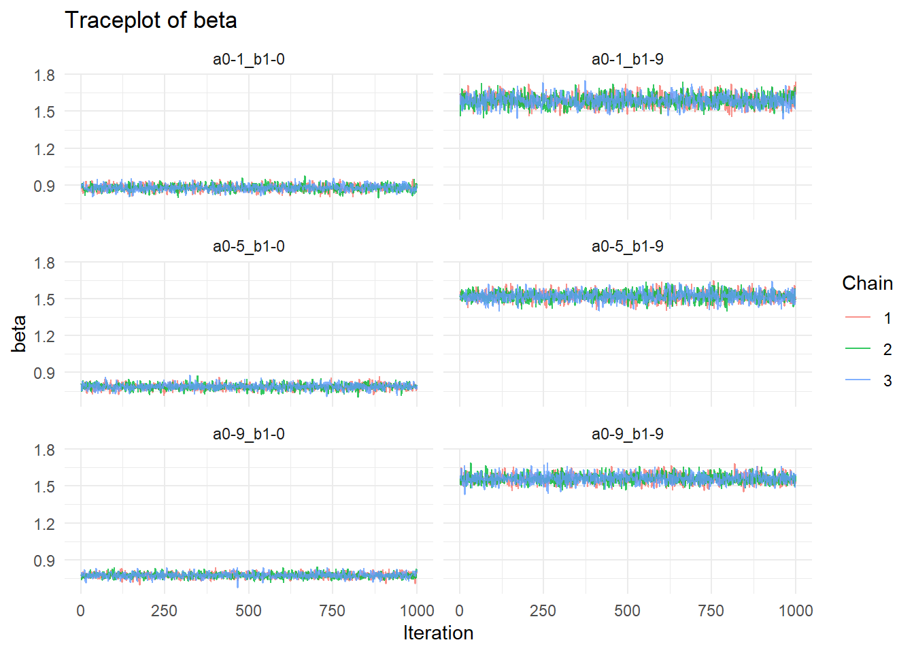
```

### 3.4.10 T0-3_r2-2-0-15/7_50agents
```{r}

```

### 3.4.11 T0-3_r2-2-0-24/7_50agents
```{r}

```

### 3.4.12 T0-3_r2-2-0-60/7_50agents
```{r}

```

### 3.4.13 T0-9_r5-5-0-30_50agents
```{r}

```

### 3.4.14 T0-4_r5-5-0-30_50agents
```{r}

```

### 3.4.15 T0-1_r5-5-0-30_50agents
```{r}
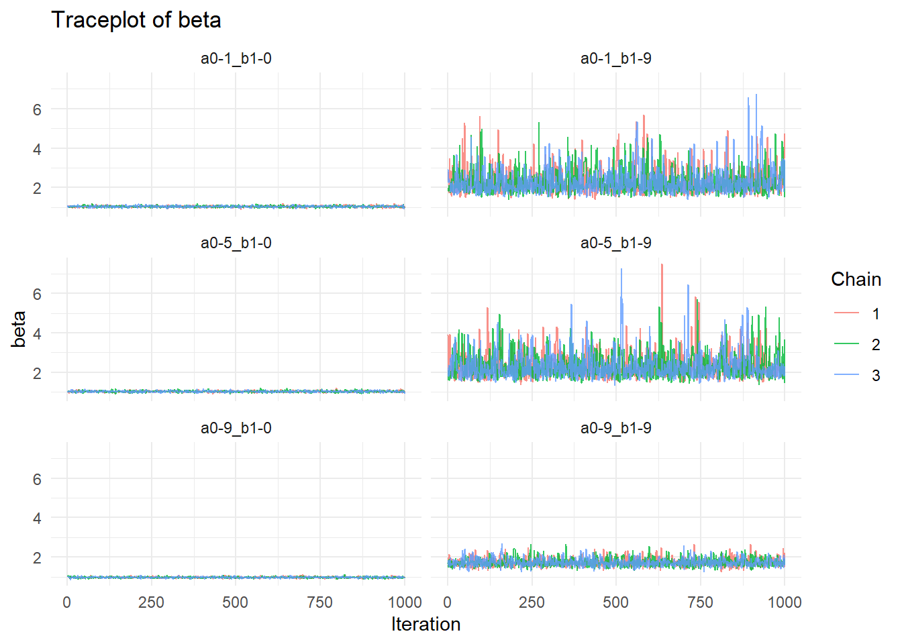
```

### 3.4.16 T0-9_r5-5-0-15_50agents
```{r}

```

### 3.4.17 T0-4_r5-5-0-15_50agents
```{r}

```

### 3.4.18 T0-1_r5-5-0-15_50agents
```{r}

```

### 3.4.19 T0-9_r2-2-0-10_50agents
```{r}

```

### 3.4.20 T0-4_r2-2-0-10_50agents
```{r}

```

### 3.4.21 T0-1_r2-2-0-10_50agents
```{r}

```

### 3.4.22 T0-9_r2-2-0-5_50agents
```{r}

```

### 3.4.23 T0-4_r2-2-0-5_50agents
```{r}

```

### 3.4.24 T0-1_r2-2-0-5_50agents
```{r}

```

## 3.5 traceplot Q_init1 {.tabset .tabset-fade .tabset-pills}

### 3.5.1 T0-7_r5-5-0-15_50agents
```{r}

```

### 3.5.2 T0-7_r5-5-0-18_50agents
```{r}

```

### 3.5.3 T0-7_r5-5-0-30_50agents
```{r}

```

### 3.5.4 T0-3_r5-5-0-45/7_50agents
```{r}

```

### 3.5.5 T0-3_r5-5-0-54/7_50agents
```{r}

```

### 3.5.6 T0-3_r5-5-0-90/7_50agents
```{r}

```

### 3.5.7 T0-7_r2-2-0-5_50agents
```{r}

```

### 3.5.8 T0-7_r2-2-0-8_50agents
```{r}

```

### 3.5.9 T0-7_r2-2-0-20_50agents
```{r}

```

### 3.5.10 T0-3_r2-2-0-15/7_50agents
```{r}

```

### 3.5.11 T0-3_r2-2-0-24/7_50agents
```{r}

```

### 3.5.12 T0-3_r2-2-0-60/7_50agents
```{r}

```

### 3.5.13 T0-9_r5-5-0-30_50agents
```{r}
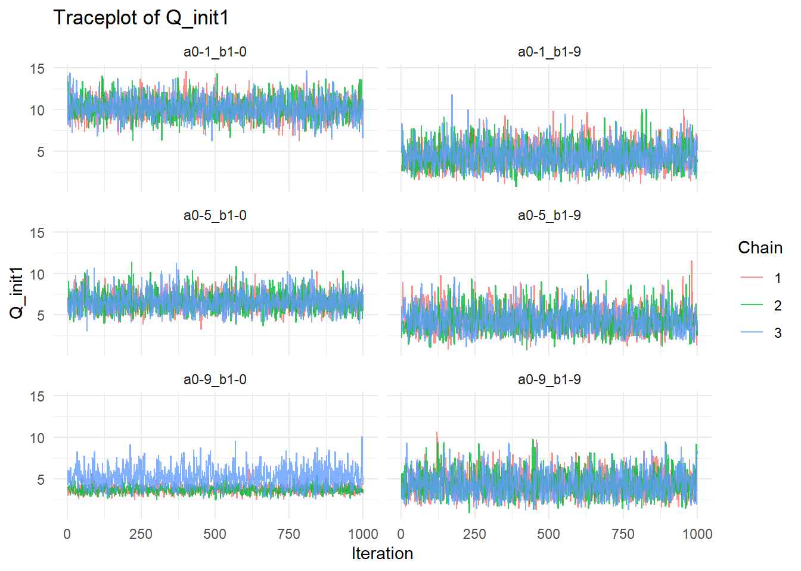
```

### 3.5.14 T0-4_r5-5-0-30_50agents
```{r}

```

### 3.5.15 T0-1_r5-5-0-30_50agents
```{r}

```

### 3.5.16 T0-9_r5-5-0-15_50agents
```{r}

```

### 3.5.17 T0-4_r5-5-0-15_50agents
```{r}

```

### 3.5.18 T0-1_r5-5-0-15_50agents
```{r}

```

### 3.5.19 T0-9_r2-2-0-10_50agents
```{r}

```

### 3.5.20 T0-4_r2-2-0-10_50agents
```{r}

```

### 3.5.21 T0-1_r2-2-0-10_50agents
```{r}

```

### 3.5.22 T0-9_r2-2-0-5_50agents
```{r}

```

### 3.5.23 T0-4_r2-2-0-5_50agents
```{r}

```

### 3.5.24 T0-1_r2-2-0-5_50agents
```{r}

```

## 4.1 事後分布 alpha {.tabset .tabset-fade .tabset-pills}

### 4.1.1 T0-7_r5-5-0-15_50agents
```{r}

```

### 4.1.2 T0-7_r5-5-0-18_50agents
```{r}

```

### 4.1.3 T0-7_r5-5-0-30_50agents
```{r}

```

### 4.1.4 T0-3_r5-5-0-45/7_50agents
```{r}
knitr::include_graphics("figure-html4/zigoalpha1-1.png")
```

### 4.1.5 T0-3_r5-5-0-54/7_50agents
```{r}

```

### 4.1.6 T0-3_r5-5-0-90/7_50agents
```{r}

```

### 4.1.7 T0-7_r2-2-0-5_50agents
```{r}

```

### 4.1.8 T0-7_r2-2-0-8_50agents
```{r}

```

### 4.1.9 T0-7_r2-2-0-20_50agents
```{r}

```

### 4.1.10 T0-3_r2-2-0-15/7_50agents
```{r}

```

### 4.1.11 T0-3_r2-2-0-24/7_50agents
```{r}

```

### 4.1.12 T0-3_r2-2-0-60/7_50agents
```{r}

```

### 4.1.13 T0-9_r5-5-0-30_50agents
```{r}

```

### 4.1.14 T0-4_r5-5-0-30_50agents
```{r}

```

### 4.1.15 T0-1_r5-5-0-30_50agents
```{r}
knitr::include_graphics("figure-html15/zigoalpha1-1.png")
```

### 4.1.16 T0-9_r5-5-0-15_50agents
```{r}

```

### 4.1.17 T0-4_r5-5-0-15_50agents
```{r}

```

### 4.1.18 T0-1_r5-5-0-15_50agents
```{r}

```

### 4.1.19 T0-9_r2-2-0-10_50agents
```{r}
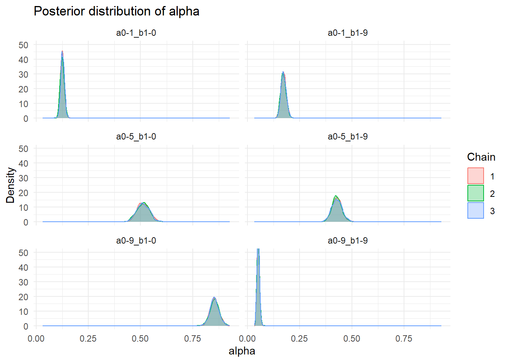
```

### 4.1.20 T0-4_r2-2-0-10_50agents
```{r}
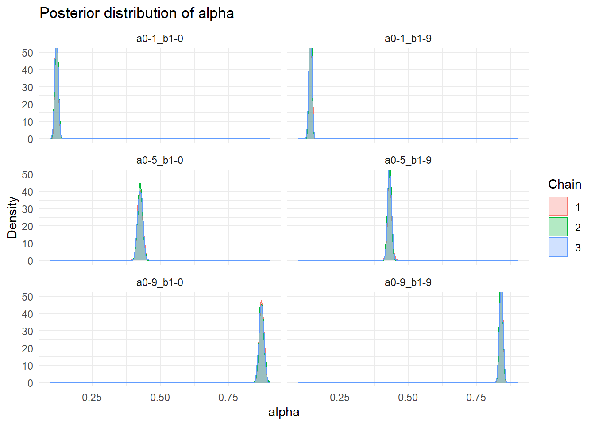
```

### 4.1.21 T0-1_r2-2-0-10_50agents
```{r}

```

### 4.1.22 T0-9_r2-2-0-5_50agents
```{r}

```

### 4.1.23 T0-4_r2-2-0-5_50agents
```{r}

```

### 4.1.24 T0-1_r2-2-0-5_50agents
```{r}
knitr::include_graphics("figure-html24/zigoalpha1-1.png")
```

## 4.2 事後分布 beta {.tabset .tabset-fade .tabset-pills}

### 4.2.1 T0-7_r5-5-0-15_50agents
```{r}

```

### 4.2.2 T0-7_r5-5-0-18_50agents
```{r}

```

### 4.2.3 T0-7_r5-5-0-30_50agents
```{r}

```

### 4.2.4 T0-3_r5-5-0-45/7_50agents
```{r}
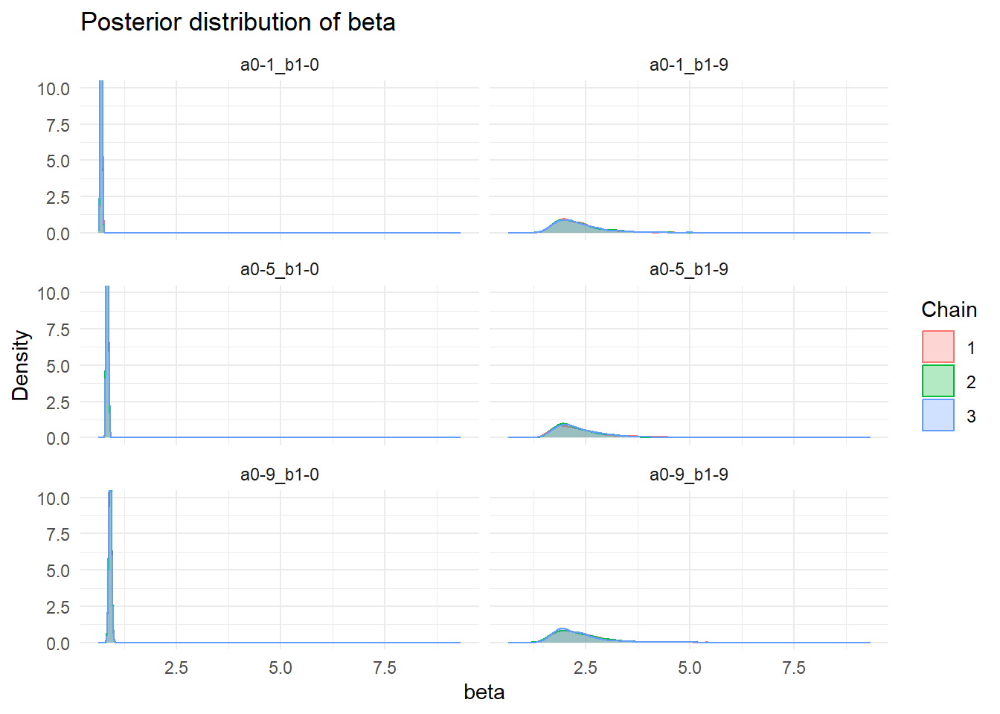
```

### 4.2.5 T0-3_r5-5-0-54/7_50agents
```{r}

```

### 4.2.6 T0-3_r5-5-0-90/7_50agents
```{r}

```

### 4.2.7 T0-7_r2-2-0-5_50agents
```{r}

```

### 4.2.8 T0-7_r2-2-0-8_50agents
```{r}

```

### 4.2.9 T0-7_r2-2-0-20_50agents
```{r}

```

### 4.2.10 T0-3_r2-2-0-15/7_50agents
```{r}

```

### 4.2.11 T0-3_r2-2-0-24/7_50agents
```{r}

```

### 4.2.12 T0-3_r2-2-0-60/7_50agents
```{r}

```

### 4.2.13 T0-9_r5-5-0-30_50agents
```{r}

```

### 4.2.14 T0-4_r5-5-0-30_50agents
```{r}

```

### 4.2.15 T0-1_r5-5-0-30_50agents
```{r}

```

### 4.2.16 T0-9_r5-5-0-15_50agents
```{r}

```

### 4.2.17 T0-4_r5-5-0-15_50agents
```{r}
knitr::include_graphics("figure-html17/zigobeta1-1.png")
```

### 4.2.18 T0-1_r5-5-0-15_50agents
```{r}
knitr::include_graphics("figure-html18/zigobeta1-1.png")
```

### 4.2.19 T0-9_r2-2-0-10_50agents
```{r}

```

### 4.2.20 T0-4_r2-2-0-10_50agents
```{r}

```

### 4.2.21 T0-1_r2-2-0-10_50agents
```{r}

```

### 4.2.22 T0-9_r2-2-0-5_50agents
```{r}

```

### 4.2.23 T0-4_r2-2-0-5_50agents
```{r}

```

### 4.2.24 T0-1_r2-2-0-5_50agents
```{r}

```

## 4.3 事後分布 Q_init1 {.tabset .tabset-fade .tabset-pills}

### 4.3.1 T0-7_r5-5-0-15_50agents
```{r}

```

### 4.3.2 T0-7_r5-5-0-18_50agents
```{r}

```

### 4.3.3 T0-7_r5-5-0-30_50agents
```{r}

```

### 4.3.4 T0-3_r5-5-0-45/7_50agents
```{r}

```

### 4.3.5 T0-3_r5-5-0-54/7_50agents
```{r}

```

### 4.3.6 T0-3_r5-5-0-90/7_50agents
```{r}

```

### 4.3.7 T0-7_r2-2-0-5_50agents
```{r}
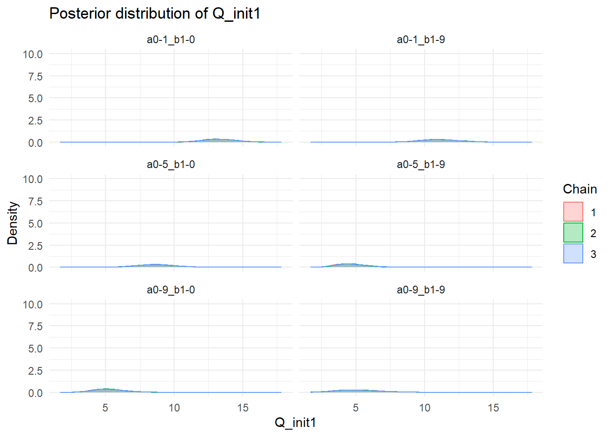
```

### 4.3.8 T0-7_r2-2-0-8_50agents
```{r}

```

### 4.3.9 T0-7_r2-2-0-20_50agents
```{r}

```

### 4.3.10 T0-3_r2-2-0-15/7_50agents
```{r}

```

### 4.3.11 T0-3_r2-2-0-24/7_50agents
```{r}

```

### 4.3.12 T0-3_r2-2-0-60/7_50agents
```{r}
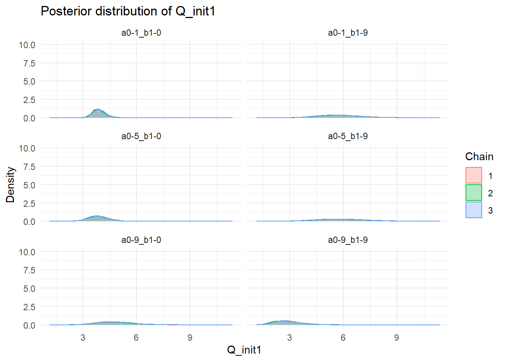
```

### 4.3.13 T0-9_r5-5-0-30_50agents
```{r}

```

### 4.3.14 T0-4_r5-5-0-30_50agents
```{r}
knitr::include_graphics("figure-html14/zigoQ_init1-1.png")
```

### 4.3.15 T0-1_r5-5-0-30_50agents
```{r}

```

### 4.3.16 T0-9_r5-5-0-15_50agents
```{r}

```

### 4.3.17 T0-4_r5-5-0-15_50agents
```{r}

```

### 4.3.18 T0-1_r5-5-0-15_50agents
```{r}

```

### 4.3.19 T0-9_r2-2-0-10_50agents
```{r}

```

### 4.3.20 T0-4_r2-2-0-10_50agents
```{r}

```

### 4.3.21 T0-1_r2-2-0-10_50agents
```{r}

```

### 4.3.22 T0-9_r2-2-0-5_50agents
```{r}

```

### 4.3.23 T0-4_r2-2-0-5_50agents
```{r}

```

### 4.3.24 T0-1_r2-2-0-5_50agents
```{r}

```

## 5 実際の選択確率と事後予測プロットの比較 {.tabset .tabset-fade .tabset-pills}

### 5.1 T0-7_r5-5-0-15_50agents
```{r}

```

### 5.2 T0-7_r5-5-0-18_50agents
```{r}

```

### 5.3 T0-7_r5-5-0-30_50agents
```{r}

```

### 5.4 T0-3_r5-5-0-45/7_50agents
```{r}

```

### 5.5 T0-3_r5-5-0-54/7_50agents
```{r}

```

### 5.6 T0-3_r5-5-0-90/7_50agents
```{r}

```

### 5.7 T0-7_r2-2-0-5_50agents
```{r}

```

### 5.8 T0-7_r2-2-0-8_50agents
```{r}

```

### 5.9 T0-7_r2-2-0-20_50agents
```{r}

```

### 5.10 T0-3_r2-2-0-15/7_50agents
```{r}

```

### 5.11 T0-3_r2-2-0-24/7_50agents
```{r}

```

### 5.12 T0-3_r2-2-0-60/7_50agents
```{r}
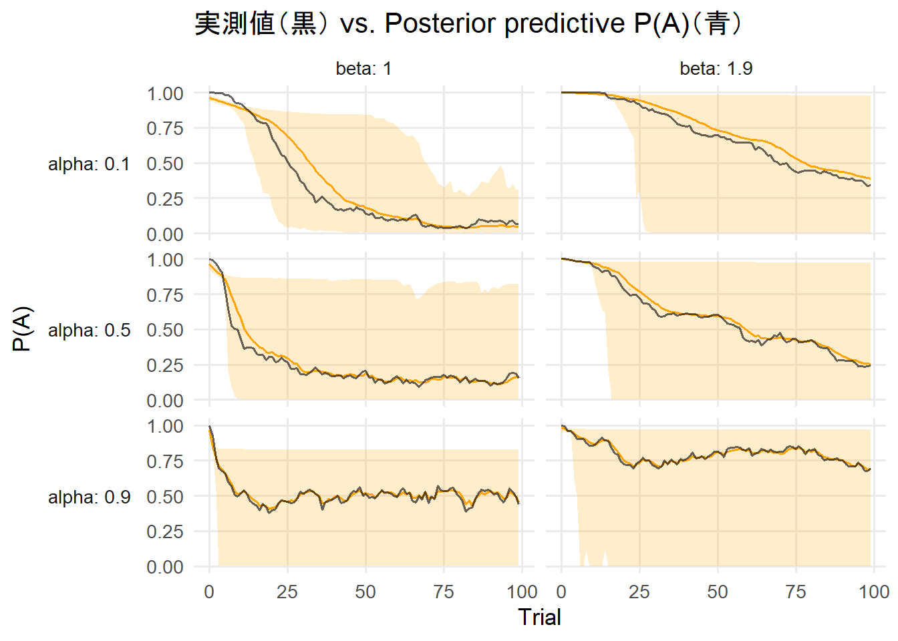
```

### 5.13 T0-9_r5-5-0-30_50agents
```{r}

```

### 5.14 T0-4_r5-5-0-30_50agents
```{r}

```

### 5.15 T0-1_r5-5-0-30_50agents
```{r}

```

### 5.16 T0-9_r5-5-0-15_50agents
```{r}

```

### 5.17 T0-4_r5-5-0-15_50agents
```{r}

```

### 5.18 T0-1_r5-5-0-15_50agents
```{r}

```

### 5.19 T0-9_r2-2-0-10_50agents
```{r}

```

### 5.20 T0-4_r2-2-0-10_50agents
```{r}

```

### 5.21 T0-1_r2-2-0-10_50agents
```{r}

```

### 5.22 T0-9_r2-2-0-5_50agents
```{r}

```

### 5.23 T0-4_r2-2-0-5_50agents
```{r}

```

### 5.24 T0-1_r2-2-0-5_50agents
```{r}

```

