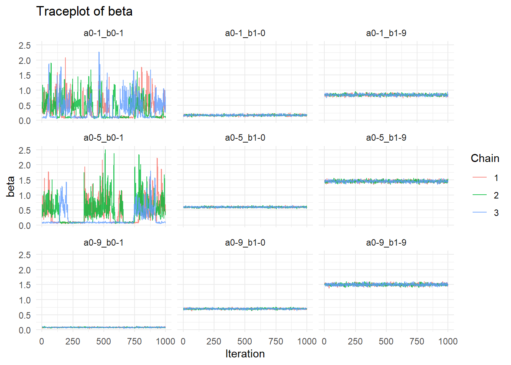
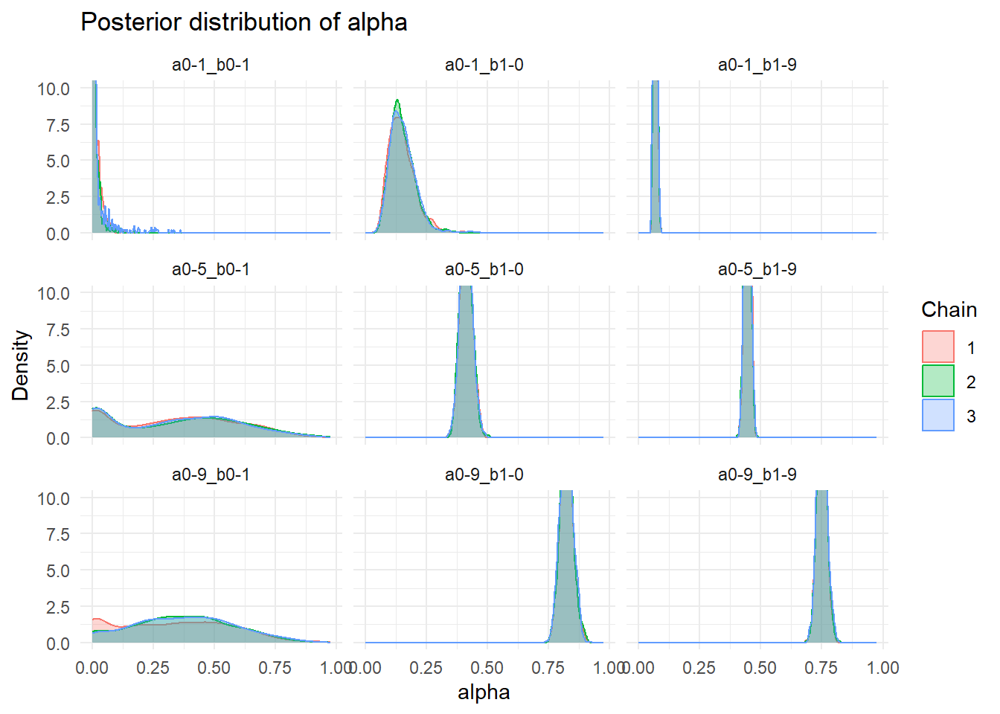
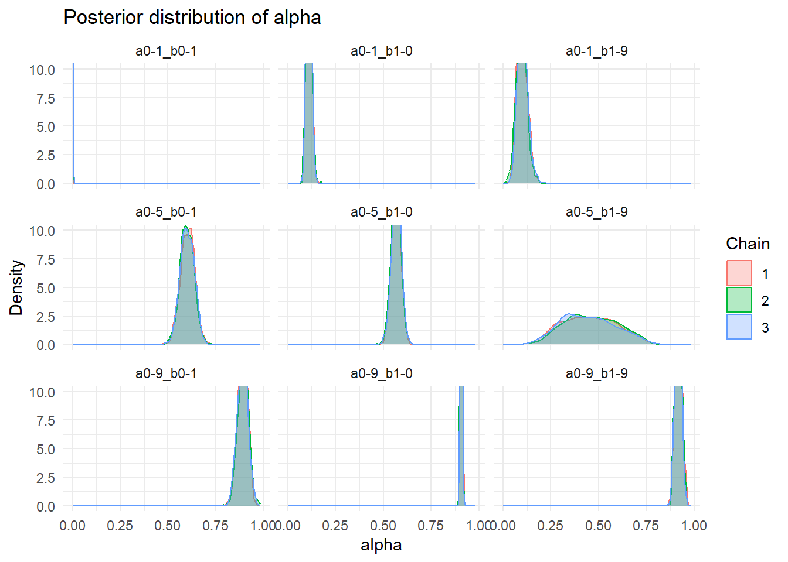
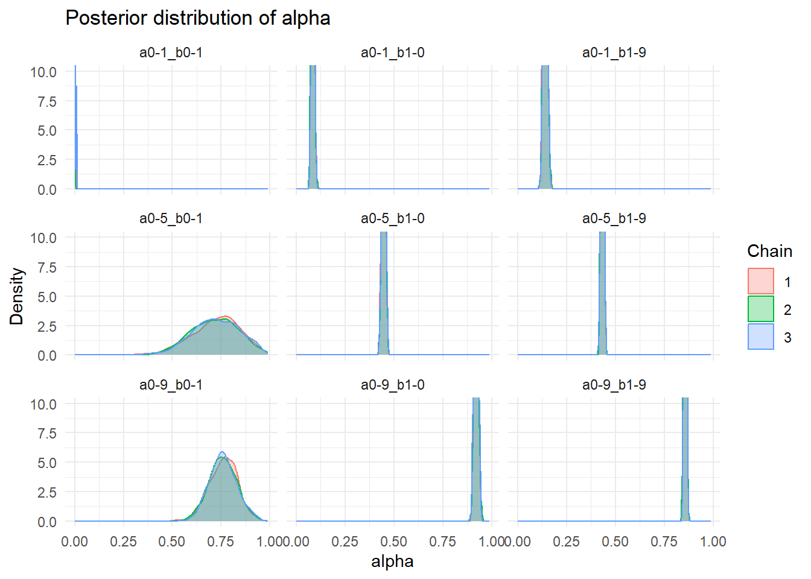
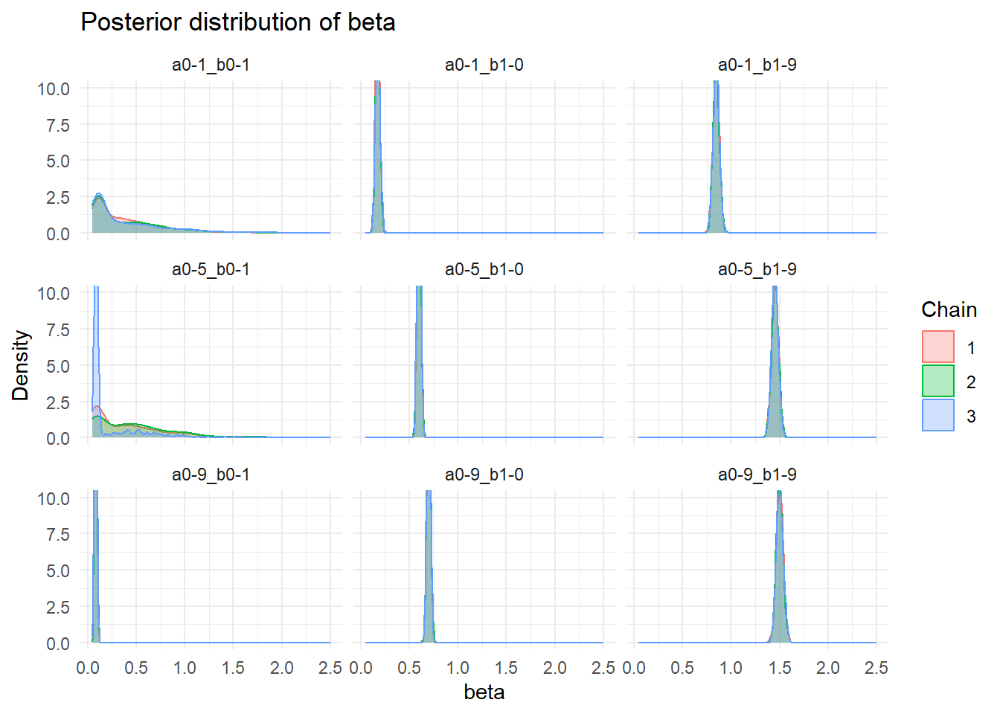
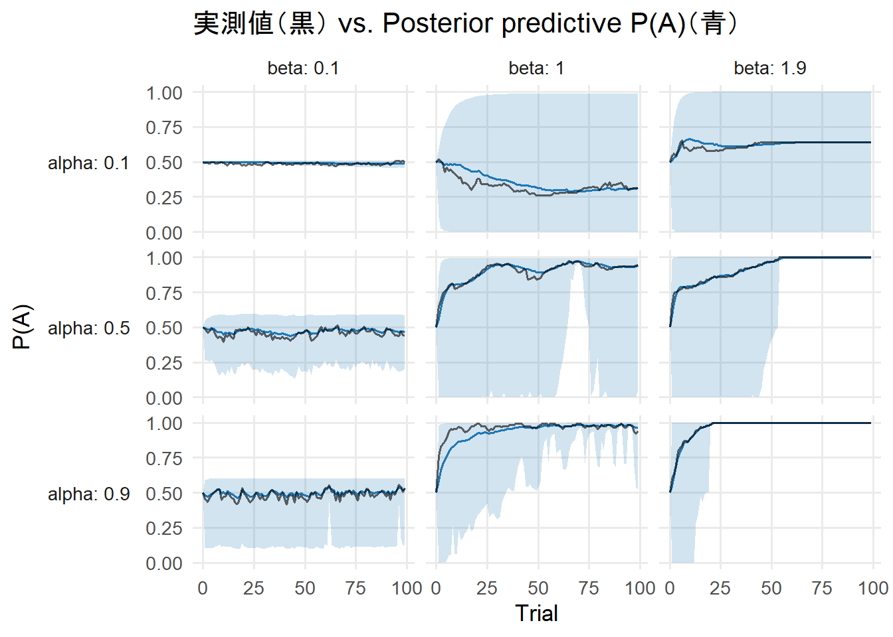
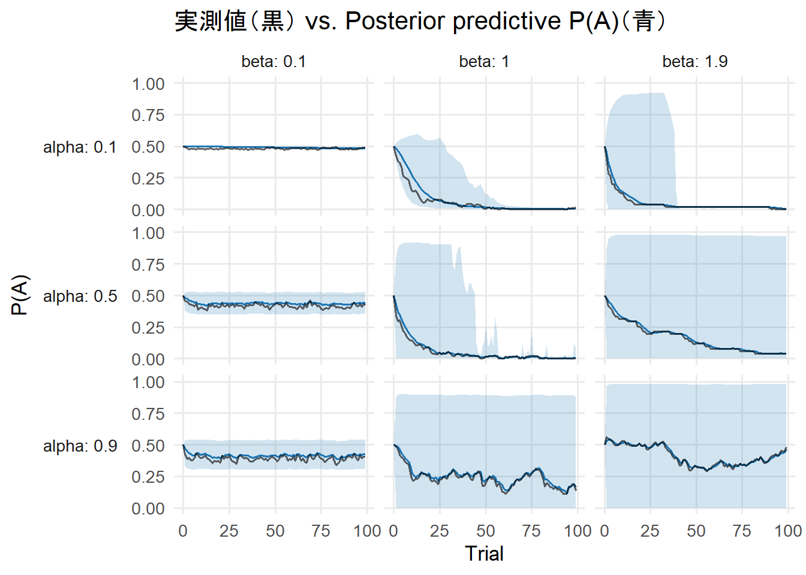

```{r setup, include=FALSE}
library(tidyverse)
library(gridExtra)
library(cmdstanr)
library(posterior)
library(knitr)
library(ggplot2)
library(bayesplot) 
library(stringr)
library(tools)
library(fs)
library(glue)
library(png)
library(grid)
library(purrr)
library(dplyr)


knitr::opts_chunk$set(echo = TRUE)
```

# 1.目的

## 1.1【大きい目的】

人間が社会規範に従うメカニズムを明らかにする

そのために、既存の複数の理論が提案する「規範遵守のメカニズム」が、互いにどのように異なり、どのように識別可能であるかを明らかにしたい


## 1.2【中ぐらいの目的】

フィッティング（パラメータリカバリー）を行うことで以下のことを確認する

強化学習エージェントから生成された行動データに対して、それぞれの強化学習モデルをフィッティングして、パラメータがうまく推定されているかを確認する

たとえば学習率 = 0.6、 逆温度 = 0.2という値の下で生成されたデータに、モデルをフィッティングしたとき、この2つの値が推定されないならば、モデルフィッティングがあまりうまくいかないことを意味する

## 1.3【小さい目的】

課題ごとでフィッティング結果にどのような違いがあるかを確認する。

# 2.課題設定

t0では、行動A（規範的な行動）を確率P(A)で、行動B（非規範的な行動）を確率1-P(A)で選択する

行動Aを選択すると確率T(r1| t0, A)でr1に、1-T(r2| t0, A)でr2の報酬を受け取る

行動Bを選択すると確率T(r3| t0, B)でr3に、1-T(r4| t0, B)でr4の報酬を受け取る

## 2.1 実施内容

各モデルから1つのパラメータ条件を選び、フィッティングする

フィッティング結果に対して、それぞれのモデルのパラメータにおけるtraceplotと事後分布をプロットする

フィッティング結果に対して、実際の選択確率と事後予測プロットの比較をする


# 3 プロット

## 3.1 生成データの確認

## 50人のデータと5000人のデータの比較 {.tabset .tabset-fade .tabset-pills}

### T0-7_r5-5-0-15_50agents
```{r}
knitr::include_graphics(c("figure-html1/hyouzi-1.png","figure-html1/hyouzi2-1.png"))
```

### T0-7_r5-5-0-18_50agents
```{r}
knitr::include_graphics(c("figure-html2/hyouzi-1.png","figure-html2/hyouzi2-1.png"))
```

### T0-7_r5-5-0-30_50agents
```{r}
knitr::include_graphics(c("figure-html3/hyouzi-1.png","figure-html3/hyouzi2-1.png"))
```

### T0-3_r5-5-0-45/7_50agents
```{r}
knitr::include_graphics(c("figure-html4/hyouzi-1.png","figure-html4/hyouzi2-1.png"))
```

### T0-3_r5-5-0-54/7_50agents
```{r}
knitr::include_graphics(c("figure-html5/hyouzi-1.png","figure-html5/hyouzi2-1.png"))
```

### T0-3_r5-5-0-90/7_50agents
```{r}
knitr::include_graphics(c("figure-html6/hyouzi-1.png","figure-html6/hyouzi2-1.png"))
```

### T0-7_r2-2-0-5_50agents
```{r}
knitr::include_graphics(c("figure-html7/hyouzi-1.png","figure-html7/hyouzi2-1.png"))
```

### T0-7_r2-2-0-8_50agents
```{r}
knitr::include_graphics(c("figure-html8/hyouzi-1.png","figure-html8/hyouzi2-1.png"))
```

### T0-7_r2-2-0-20_50agents
```{r}
knitr::include_graphics(c("figure-html9/hyouzi-1.png","figure-html9/hyouzi2-1.png"))
```

### T0-3_r2-2-0-15/7_50agents
```{r}
knitr::include_graphics(c("figure-html10/hyouzi-1.png","figure-html10/hyouzi2-1.png"))
```

### T0-3_r2-2-0-24/7_50agents
```{r}
knitr::include_graphics(c("figure-html11/hyouzi-1.png","figure-html11/hyouzi2-1.png"))
```

### T0-3_r2-2-0-60/7_50agents
```{r}
knitr::include_graphics(c("figure-html12/hyouzi-1.png","figure-html12/hyouzi2-1.png"))
```

### T0-9_r5-5-0-30_50agents
```{r}
knitr::include_graphics(c("figure-html13/hyouzi-1.png","figure-html13/hyouzi2-1.png"))
```

### T0-4_r5-5-0-30_50agents
```{r}
knitr::include_graphics(c("figure-html14/hyouzi-1.png","figure-html14/hyouzi2-1.png"))
```

### T0-1_r5-5-0-30_50agents
```{r}
knitr::include_graphics(c("figure-html15/hyouzi-1.png","figure-html15/hyouzi2-1.png"))
```

### T0-9_r5-5-0-15_50agents
```{r}
knitr::include_graphics(c("figure-html16/hyouzi-1.png","figure-html16/hyouzi2-1.png"))
```

### T0-4_r5-5-0-15_50agents
```{r}
knitr::include_graphics(c("figure-html17/hyouzi-1.png","figure-html17/hyouzi2-1.png"))
```

### T0-1_r5-5-0-15_50agents
```{r}
knitr::include_graphics(c("figure-html18/hyouzi-1.png","figure-html18/hyouzi2-1.png"))
```

### T0-9_r2-2-0-10_50agents
```{r}
knitr::include_graphics(c("figure-html19/hyouzi-1.png","figure-html19/hyouzi2-1.png"))
```

### T0-4_r2-2-0-10_50agents
```{r}
knitr::include_graphics(c("figure-html20/hyouzi-1.png","figure-html20/hyouzi2-1.png"))
```

### T0-1_r2-2-0-10_50agents
```{r}
knitr::include_graphics(c("figure-html21/hyouzi-1.png","figure-html21/hyouzi2-1.png"))
```

### T0-9_r2-2-0-5_50agents
```{r}
knitr::include_graphics(c("figure-html22/hyouzi-1.png","figure-html22/hyouzi2-1.png"))
```

### T0-4_r2-2-0-5_50agents
```{r}
knitr::include_graphics(c("figure-html23/hyouzi-1.png","figure-html23/hyouzi2-1.png"))
```

### T0-1_r2-2-0-5_50agents
```{r}
knitr::include_graphics(c("figure-html24/hyouzi-1.png","figure-html24/hyouzi2-1.png"))
```


## 3.2 プロットの比較

## traceplot alpha {.tabset .tabset-fade .tabset-pills}

### T0-7_r5-5-0-15_50agents
```{r}

```

### T0-7_r5-5-0-18_50agents
```{r}

```

### T0-7_r5-5-0-30_50agents
```{r}

```

### T0-3_r5-5-0-45/7_50agents
```{r}

```

### T0-3_r5-5-0-54/7_50agents
```{r}

```

### T0-3_r5-5-0-90/7_50agents
```{r}

```

### T0-7_r2-2-0-5_50agents
```{r}
knitr::include_graphics("figure-html7/alpha1-1.png")
```

### T0-7_r2-2-0-8_50agents
```{r}

```

### T0-7_r2-2-0-20_50agents
```{r}

```

### T0-3_r2-2-0-15/7_50agents
```{r}

```

### T0-3_r2-2-0-24/7_50agents
```{r}

```

### T0-3_r2-2-0-60/7_50agents
```{r}

```

### T0-9_r5-5-0-30_50agents
```{r}

```

### T0-4_r5-5-0-30_50agents
```{r}

```

### T0-1_r5-5-0-30_50agents
```{r}

```

### T0-9_r5-5-0-15_50agents
```{r}

```

### T0-4_r5-5-0-15_50agents
```{r}

```

### T0-1_r5-5-0-15_50agents
```{r}

```

### T0-9_r2-2-0-10_50agents
```{r}

```

### T0-4_r2-2-0-10_50agents
```{r}
knitr::include_graphics("figure-html20/alpha1-1.png")
```

### T0-1_r2-2-0-10_50agents
```{r}

```

### T0-9_r2-2-0-5_50agents
```{r}

```

### T0-4_r2-2-0-5_50agents
```{r}

```

### T0-1_r2-2-0-5_50agents
```{r}

```


## traceplot beta {.tabset .tabset-fade .tabset-pills}

### T0-7_r5-5-0-15_50agents
```{r}

```

### T0-7_r5-5-0-18_50agents
```{r}
knitr::include_graphics("figure-html2/beta1-1.png")
```

### T0-7_r5-5-0-30_50agents
```{r}

```

### T0-3_r5-5-0-45/7_50agents
```{r}

```

### T0-3_r5-5-0-54/7_50agents
```{r}

```

### T0-3_r5-5-0-90/7_50agents
```{r}

```

### T0-7_r2-2-0-5_50agents
```{r}

```

### T0-7_r2-2-0-8_50agents
```{r}

```

### T0-7_r2-2-0-20_50agents
```{r}

```

### T0-3_r2-2-0-15/7_50agents
```{r}

```

### T0-3_r2-2-0-24/7_50agents
```{r}

```

### T0-3_r2-2-0-60/7_50agents
```{r}

```

### T0-9_r5-5-0-30_50agents
```{r}

```

### T0-4_r5-5-0-30_50agents
```{r}

```

### T0-1_r5-5-0-30_50agents
```{r}

```

### T0-9_r5-5-0-15_50agents
```{r}

```

### T0-4_r5-5-0-15_50agents
```{r}

```

### T0-1_r5-5-0-15_50agents
```{r}

```

### T0-9_r2-2-0-10_50agents
```{r}

```

### T0-4_r2-2-0-10_50agents
```{r}

```

### T0-1_r2-2-0-10_50agents
```{r}

```

### T0-9_r2-2-0-5_50agents
```{r}

```

### T0-4_r2-2-0-5_50agents
```{r}

```

### T0-1_r2-2-0-5_50agents
```{r}

```


## 事後分布 alpha {.tabset .tabset-fade .tabset-pills}

### T0-7_r5-5-0-15_50agents
```{r}

```

### T0-7_r5-5-0-18_50agents
```{r}

```

### T0-7_r5-5-0-30_50agents
```{r}
knitr::include_graphics("figure-html3/zigoalpha1-1.png")
```

### T0-3_r5-5-0-45/7_50agents
```{r}

```

### T0-3_r5-5-0-54/7_50agents
```{r}

```

### T0-3_r5-5-0-90/7_50agents
```{r}

```

### T0-7_r2-2-0-5_50agents
```{r}
knitr::include_graphics("figure-html7/zigoalpha1-1.png")
```

### T0-7_r2-2-0-8_50agents
```{r}

```

### T0-7_r2-2-0-20_50agents
```{r}

```

### T0-3_r2-2-0-15/7_50agents
```{r}
knitr::include_graphics("figure-html10/zigoalpha1-1.png")
```

### T0-3_r2-2-0-24/7_50agents
```{r}

```

### T0-3_r2-2-0-60/7_50agents
```{r}

```

### T0-9_r5-5-0-30_50agents
```{r}

```

### T0-4_r5-5-0-30_50agents
```{r}

```

### T0-1_r5-5-0-30_50agents
```{r}

```

### T0-9_r5-5-0-15_50agents
```{r}

```

### T0-4_r5-5-0-15_50agents
```{r}

```

### T0-1_r5-5-0-15_50agents
```{r}

```

### T0-9_r2-2-0-10_50agents
```{r}

```

### T0-4_r2-2-0-10_50agents
```{r}

```

### T0-1_r2-2-0-10_50agents
```{r}

```

### T0-9_r2-2-0-5_50agents
```{r}
knitr::include_graphics("figure-html22/zigoalpha1-1.png")
```

### T0-4_r2-2-0-5_50agents
```{r}

```

### T0-1_r2-2-0-5_50agents
```{r}

```

## 事後分布 beta {.tabset .tabset-fade .tabset-pills}

### T0-7_r5-5-0-15_50agents
```{r}

```

### T0-7_r5-5-0-18_50agents
```{r}

```

### T0-7_r5-5-0-30_50agents
```{r}

```

### T0-3_r5-5-0-45/7_50agents
```{r}

```

### T0-3_r5-5-0-54/7_50agents
```{r}

```

### T0-3_r5-5-0-90/7_50agents
```{r}

```

### T0-7_r2-2-0-5_50agents
```{r}

```

### T0-7_r2-2-0-8_50agents
```{r}

```

### T0-7_r2-2-0-20_50agents
```{r}

```

### T0-3_r2-2-0-15/7_50agents
```{r}

```

### T0-3_r2-2-0-24/7_50agents
```{r}

```

### T0-3_r2-2-0-60/7_50agents
```{r}

```

### T0-9_r5-5-0-30_50agents
```{r}

```

### T0-4_r5-5-0-30_50agents
```{r}

```

### T0-1_r5-5-0-30_50agents
```{r}

```

### T0-9_r5-5-0-15_50agents
```{r}

```

### T0-4_r5-5-0-15_50agents
```{r}

```

### T0-1_r5-5-0-15_50agents
```{r}

```

### T0-9_r2-2-0-10_50agents
```{r}

```

### T0-4_r2-2-0-10_50agents
```{r}

```

### T0-1_r2-2-0-10_50agents
```{r}

```

### T0-9_r2-2-0-5_50agents
```{r}

```

### T0-4_r2-2-0-5_50agents
```{r}

```

### T0-1_r2-2-0-5_50agents
```{r}

```


## 実際の選択確率と事後予測プロットの比較 {.tabset .tabset-fade .tabset-pills}

### T0-7_r5-5-0-15_50agents
```{r}

```

### T0-7_r5-5-0-18_50agents
```{r}

```

### T0-7_r5-5-0-30_50agents
```{r}

```

### T0-3_r5-5-0-45/7_50agents
```{r}

```

### T0-3_r5-5-0-54/7_50agents
```{r}

```

### T0-3_r5-5-0-90/7_50agents
```{r}

```

### T0-7_r2-2-0-5_50agents
```{r}

```

### T0-7_r2-2-0-8_50agents
```{r}

```

### T0-7_r2-2-0-20_50agents
```{r}

```

### T0-3_r2-2-0-15/7_50agents
```{r}

```

### T0-3_r2-2-0-24/7_50agents
```{r}

```

### T0-3_r2-2-0-60/7_50agents
```{r}

```

### T0-9_r5-5-0-30_50agents
```{r}

```

### T0-4_r5-5-0-30_50agents
```{r}

```

### T0-1_r5-5-0-30_50agents
```{r}

```

### T0-9_r5-5-0-15_50agents
```{r}

```

### T0-4_r5-5-0-15_50agents
```{r}

```

### T0-1_r5-5-0-15_50agents
```{r}

```

### T0-9_r2-2-0-10_50agents
```{r}

```

### T0-4_r2-2-0-10_50agents
```{r}

```

### T0-1_r2-2-0-10_50agents
```{r}

```

### T0-9_r2-2-0-5_50agents
```{r}

```

### T0-4_r2-2-0-5_50agents
```{r}

```

### T0-1_r2-2-0-5_50agents
```{r}

```

